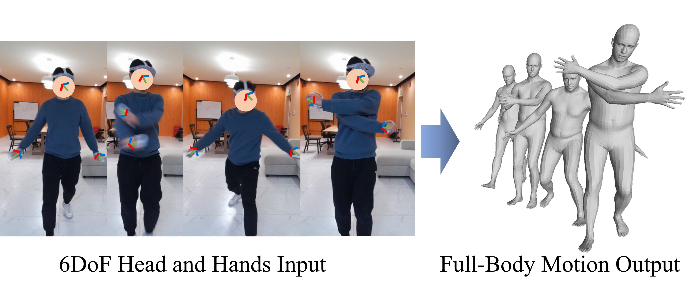

<div align="center">

<h1>Realistic Full-Body Tracking from Sparse Observations via Joint-Level Modeling</h1>

<div>
    <a href='https://scholar.google.com/citations?user=3hSD41oAAAAJ' target='_blank'>Xiaozheng Zheng<sup>†</sup></a>&emsp;
    <a href='https://suzhuo.github.io/' target='_blank'>Zhuo Su<sup>†</sup></a>&emsp;
    <a href='https://scholar.google.com/citations?user=v8TFZI4AAAAJ' target='_blank'>Chao Wen</a>&emsp;
    <a href='https://scholar.google.com/citations?&user=ECKq3aUAAAAJ' target='_blank'>Zhou Xue<sup>*</sup></a>&emsp;
    <a href='https://scholar.google.com/citations?hl=en&user=OEZ816YAAAAJ&view_op=list_works&sortby=pubdate' target='_blank'>Xiaojie Jin</a>&emsp;
</div>
<div>
    ByteDance
</div>

<div>
    <sup>†</sup>Equal contribution &emsp; <sup>*</sup>Corresponding author
</div>

<div>
    :star_struck: <strong>Accepted to ICCV 2023</strong>
</div>

---

<strong> AvatarJLM uses tracking signals of head and hands to estimate accurate, smooth, and plausible full-body motions. </strong>


:open_book: For more visual results, go checkout our <a href="https://zxz267.github.io/AvatarJLM/" target="_blank">project page</a>

---

<h4 align="center">
  <a href="https://zxz267.github.io/AvatarJLM/" target='_blank'>[Project Page]</a> •
  <a href="https://arxiv.org/abs/2308.08855" target='_blank'>[arXiv]</a>
</h4>

</div>

## :mega: Updates

[09/2023] Training and testing codes are released.

[07/2023] AvatarJLM is accepted to ICCV 2023:partying_face:!


## :file_folder: Data Preparation
1. Please download the datasets from [AMASS](https://amass.is.tue.mpg.de/).
2. Download the required body model and placed them in `./support_data/body_models` directory of this repository. For SMPL+H body model, download it from http://mano.is.tue.mpg.de/. Please download the AMASS version of the model with DMPL blendshapes. You can obtain dynamic shape blendshapes, e.g. DMPLs, from http://smpl.is.tue.mpg.de.
3. Run  `./data/prepare_data.py` to preprocess the input data for faster training. The data split for training and testing data under Protocol 1 in our paper is stored under the folder `./data/data_split` (from [AvatarPoser](https://github.com/eth-siplab/AvatarPoser)).
```
python ./data/prepare_data.py --protocol [1, 2, 3] --root [path to AMASS]
```


## :desktop_computer: Requirements
### 
- Python >= 3.9
- PyTorch >= 1.11.0
- pyrender
- trimesh
- [human_body_prior](https://github.com/nghorbani/human_body_prior)
- [body_visualizer](https://github.com/nghorbani/body_visualizer)
- [mesh](https://github.com/MPI-IS/mesh)


## :bicyclist: Training
```
python train.py --protocol [1, 2, 3] --task [name of the experiment] 
```


## :running_woman: Evaluation
```
python test.py --protocol [1, 2, 3] --task [name of the experiment] --checkpoint [path to trained checkpoint] --vis
```

## :lollipop: Trained Model
| Protocol   | MPJRE  | MPJPE  | MPJVE  |  Traind Model |
| :--------- | :----: | :----: | :----: |:-------------:|
| 1          | 2.94   | 3.23   | 20.45  |[Google Drive](https://drive.google.com/file/d/1SwMwATuxpVRKXLXK8oCsTgVp2mVsLPmb/view?usp=drive_link) |

## :love_you_gesture: Citation
If you find our work useful for your research, please consider citing the paper:
```
@inproceedings{
  zheng2023realistic,
  title={Realistic Full-Body Tracking from Sparse Observations via Joint-Level Modeling},
  author={Zheng, Xiaozheng and Zhuo Su and Wen, Chao and Xue, Zhou and Xiaojie Jin},
  booktitle={Proceedings of the IEEE/CVF international conference on computer vision},
  year={2023}
}
```

## :newspaper_roll: License

Distributed under the MIT License. See `LICENSE` for more information.

## :raised_hands: Acknowledgements
This project is built on source codes shared by [AvatarPoser](https://github.com/eth-siplab/AvatarPoser). We thank the authors for their great job!
